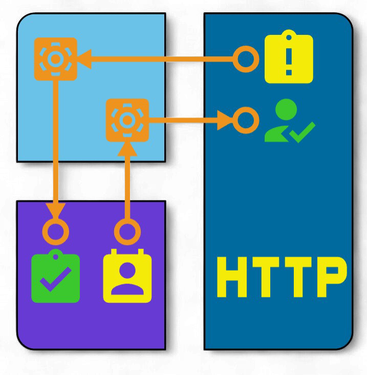
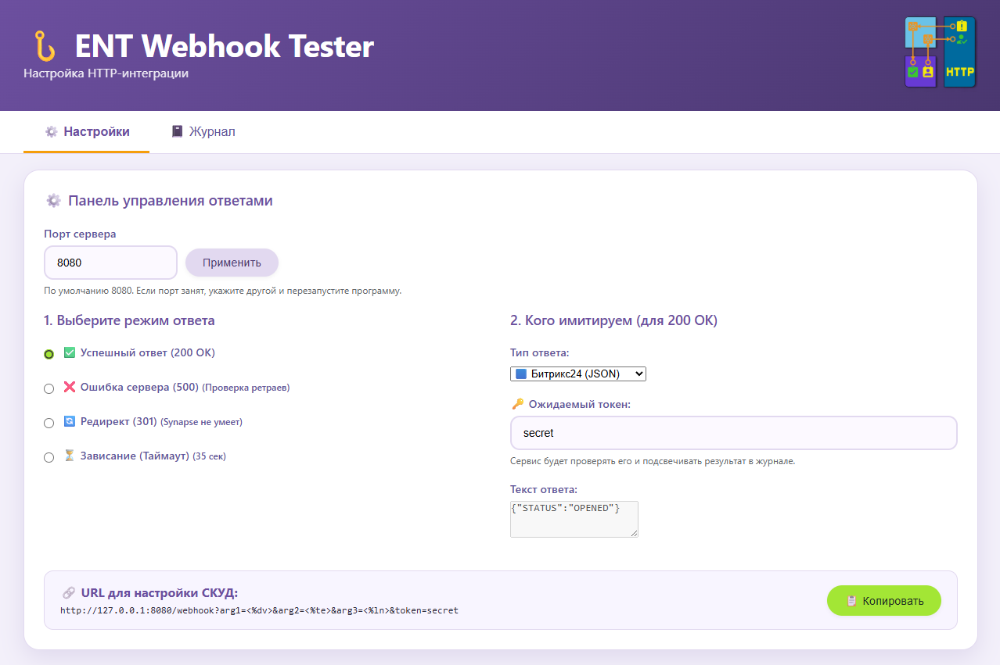
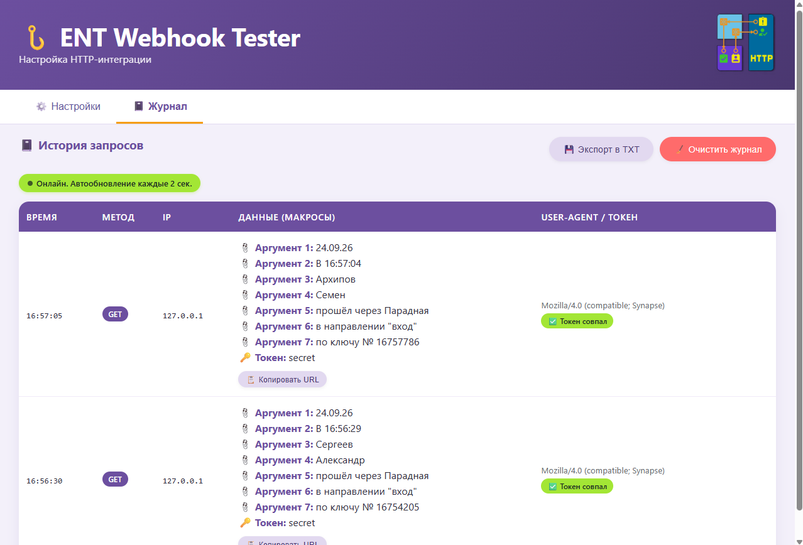
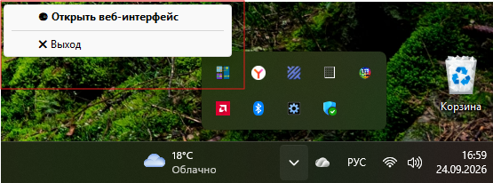

# 🌐 ENT Webhook Tester

[](https://www.python.org/)
[](https://flask.palletsprojects.com/)
[](https://www.microsoft.com/windows)
[](./version.txt)

Простой и надёжный локальный инструмент для тестирования и отладки HTTP-интеграции (вебхуков) ПО «ЭНТ Контроль доступа». 

Программа работает полностью автономно на компьютере пользователя, не требует установки и не передаёт данные во внешние сети.

---

<p align="center">
  
</p>

---

## ✨ Возможности

- 🚀 **Мгновенный запуск**: Работает из одного `.exe` файла без установки Python.
- 🖥 **Удобный веб-интерфейс**: Автоматически открывается в браузере, показывает журнал запросов в реальном времени.
- ⚙️ **Гибкая настройка**: Возможность смены порта прямо из интерфейса.
- 🔒 **Безопасность**: Работает только в локальной сети (`localhost`), имеет встроенное пользовательское соглашение (EULA).
- 📱 **Системный трей**: Удобное управление через иконку в области уведомлений Windows.

---

## 📸 Скриншоты

### Главный экран и вкладка "Настройки"


### Вкладка "Журнал"


### Управление через системный трей


---

## 📦 Установка и запуск

1. Скачайте файл `ENT_Webhook_Tester.exe` из раздела [Releases](https://github.com/SkvorcovKV/ENT_Webhook_Tester/releases) (или получите его от администратора).
2. Поместите файл в любую удобную папку (например, `C:\ENT_Tools\`).
   > ⚠️ **Важно:** Не запускайте файл напрямую из ZIP-архива, сначала распакуйте его.
3. Дважды кликните по `ENT_Webhook_Tester.exe`.
4. При первом запуске Windows может показать предупреждение Защитника. Нажмите *«Подробнее»* → *«Выполнить в любом случае»*.
5. Автоматически откроется веб-интерфейс в браузере, а в трее появится иконка программы.

---

## 🛠 Для разработчиков

Если вы хотите запустить проект из исходного кода:

```bash
# 1. Клонируйте репозиторий
git clone https://github.com/SkvorcovKV/ENT_Webhook_Tester.git
cd ENT_Webhook_Tester

# 2. Создайте и активируйте виртуальное окружение
python -m venv venv
venv\Scripts\activate

# 3. Установите зависимости
pip install -r requirements.txt  # (если есть файл, или укажите: flask pystray pillow)

# 4. Запустите приложение
python main.py
```
---

Сборка в .exe

Для создания автономного исполняемого файла используется PyInstaller:
```bash
pyinstaller --noconfirm --onefile --windowed --name "ENT_Webhook_Tester" --icon="static\icon.ico" --add-data "static;static" --add-data "templates;templates" --add-data "version.txt;." --collect-all werkzeug main.py
```
---

## 📄 Лицензия
```bash
Проект распространяется под лицензией Apache License Version 2.0, January 2004.

Copyright 2026 Скворцов Константин Валерьевич

Licensed under the Apache License, Version 2.0 (the "License");
you may not use this file except in compliance with the License.
You may obtain a copy of the License at

    http://www.apache.org/licenses/LICENSE-2.0

Unless required by applicable law or agreed to in writing, software
distributed under the License is distributed on an "AS IS" BASIS,
WITHOUT WARRANTIES OR CONDITIONS OF ANY KIND, either express or implied.
See the License for the specific language governing permissions and
limitations under the License.
```
---

## 👨‍💻 Автор

Скворцов Константин Валерьевич

📧 Email: skvorcovkv@mail.ru

🐙 GitHub: @SkvorcovKV

🤝 Поддержка и обратная связь

---

## 📞 Если у вас возникли вопросы или предложения:

📧 Email: skvorcovkv@mail.ru

🐛 Issue tracker: GitHub Issues https://github.com/SkvorcovKV/data-exchange-service/issues

📋 Документация: Wiki https://github.com/SkvorcovKV/data-exchange-service/wiki

---

## ⭐️ Благодарности

Сообществу Open Source за инструменты и библиотеки

---

📄 Документация и лицензия
📖 Инструкция пользователя
🔗 Настройка HTTP-интеграции в ПО «ЭНТ»
⚖️ Использование программы регулируется файлом EULA.txt. Все права защищены.

---

<p align="center"> <sub>Сделано с ❤️ для тестирования и демонстрации интеграционных возможностей ПО «ЭНТ Контроль доступа»</sub> </p>